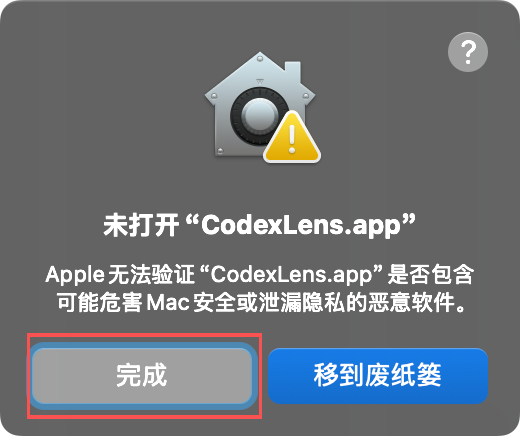
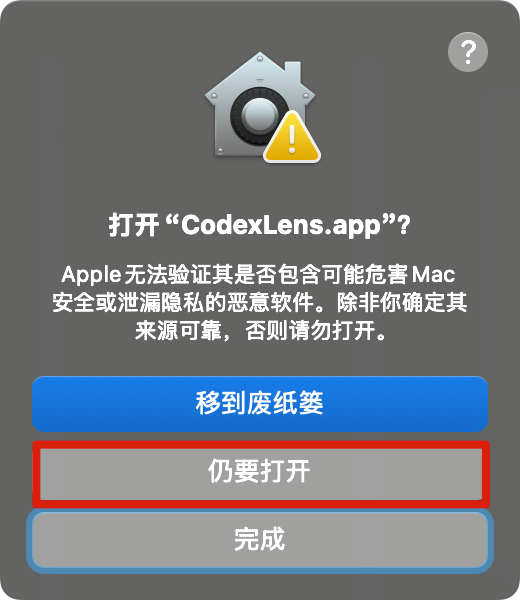
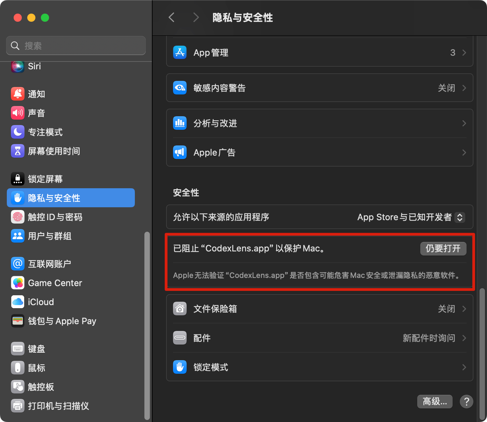

# macos安装说明

简体中文 | [English](./macos-install.en.md)

适用于首次在 macOS 上打开 `CodexLens.app` 时，系统提示“Apple 无法验证”或“已阻止该应用以保护 Mac”的场景。

## 安装步骤

### 步骤 1：首次打开应用时，点击“完成”

第一次双击打开 `CodexLens.app` 时，如果看到“未打开 `CodexLens.app`”的提示，不要点“移到废纸篓”，点击“完成”即可。

### 步骤 2：前往“隐私与安全性”，点击“仍要打开”

打开“系统设置” -> “隐私与安全性”，滚动到“安全性”区域，找到被阻止的 `CodexLens.app`，点击右侧的“仍要打开”。

### 步骤 3：在二次确认弹窗中点击“仍要打开”

系统会再次弹出确认框，这时点击“仍要打开”。

步骤3完成之后打开app会弹出文件夹授权，点允许即可。
